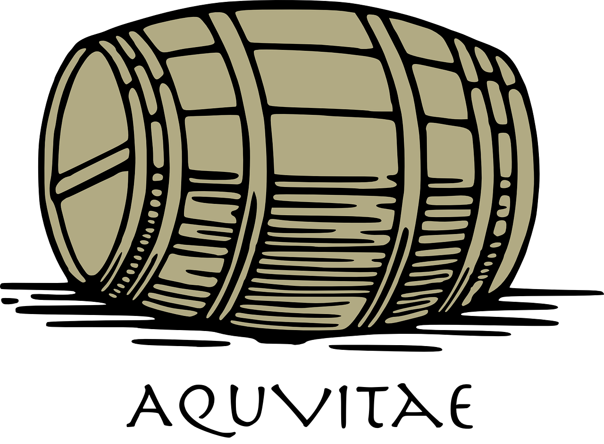

  <br>

<p align="center">
  
</p>

<h2 align=center>The Easiest Knowledge Distillation Library</h2>

[AquVitae](https://github.com/aquvitae/aquvitae) is a Python library that is the easiest to perform Knowledge Distillation through a very simple API. This library supports [TensorFlow](https://github.com/tensorflow/tensorflow) and [PyTorch](https://github.com/pytorch/pytorch). Knowledge Distillation is usually used for Lightweight Deep Learning. This library has a popular and diverse Knowledge Distillation algorithm. If the Deep Learning model used in your project is too heavy, you can use [AquVitae](https://github.com/aquvitae/aquvitae) to make the speed very fast with little loss of performance.

## Getting Started

#### TensorFlow Example

```python
from tensorflow as tf
from aquvitae import dist, ST

# Load the dataset
train_ds = ...
test_ds = ...

# Load the teacher and student model
teacher = ...
student = ...

student = dist(
    teacher=teacher,
    student=student,
    algo=ST(alpha=0.6, T=2.5),
    optimizer=tf.keras.optimizers.Adam(),
    train_ds=train_ds,
    test_ds=test_ds,
    iterations=3000
)
```

#### PyTorch Example

```python
from torch
from aquvitae import dist, ST

# Load the dataset
train_ds = ...
test_ds = ...

# Load the teacher and student model
teacher = ...
student = ...

student = dist(
    teacher=teacher,
    student=student,
    algo=ST(alpha=0.6, T=2.5),
    optimizer=torch.optim.Adam()
    train_ds=train_ds,
    test_ds=test_ds,
    iterations=3000
)
```

## Installation

```bash
$ pip install aquvitae
```

## Algorithms

List of Knowledge Distillation Algorithms implemented in [AquVitae](https://github.com/aquvitae/aquvitae).

|  Algo  |      HP      |                                        Paper                                         |  TF   | TORCH |
| :----: | :----------: | :----------------------------------------------------------------------------------: | :---: | :---: |
|   ST   | `alpha`, `T` | [Distilling the Knowledge in a Neural Network](https://arxiv.org/pdf/1503.02531.pdf) |   ✔️   |   ✔️   |
|  DML   |      -       |             [Deep Mutual Learning](https://arxiv.org/pdf/1706.00384.pdf)             |   -   |   -   |
| FitNets |      -       |       [FitNets: Hints for Thin Deep Nets](https://arxiv.org/pdf/1412.6550.pdf)       |   -   |   -   |
|  RKD   |      -       |      [Relational Knowledge Distillation](https://arxiv.org/pdf/1904.05068.pdf)       |   -   |   -   |


## License

Copyright © [marload](https://github.com/marload)

[AquVitae](https://github.com/aqvitae/aquvitae) is open-sourced software licensed under the [MIT License](https://github.com/aquvitae/aquvitae/blob/master/LICENSE).